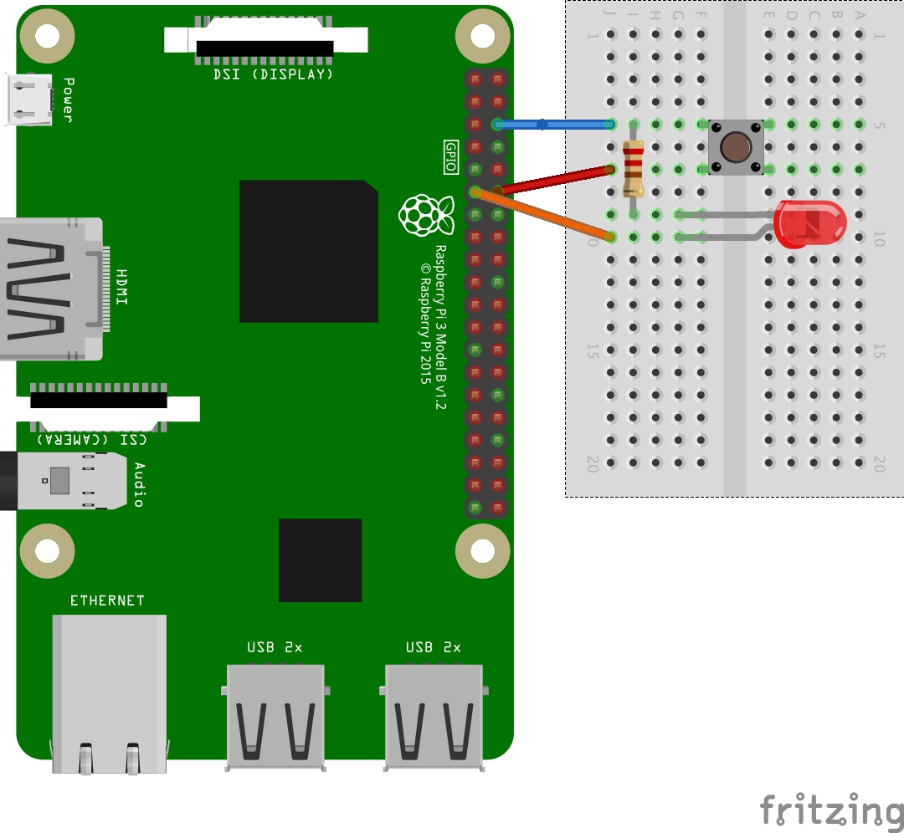
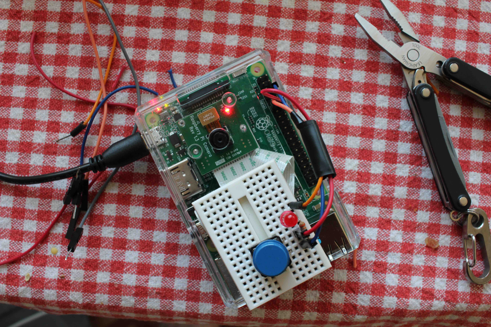

###Raspbery Pi "photo booth" build;

Button, LED count down indicator take a still and uploads it to Dropbox using [Dropbox-Uploader](https://github.com/andreafabrizi/Dropbox-Uploader).


### Hardware 

* Raspberry Pi 3
* Raspberry Pi Camera module V1
* SB Components clear case
* USB Power suply
* 1 Red diffused LED 
* 1 Push button
* 1 Tiny breadboard 

### Setup

* Clone project, code expects to be "/home/pi/Documents/Projects/pi-booth" obviously configurable

* Setup and install [Dropbox-Uploader](https://github.com/andreafabrizi/Dropbox-Uploader)

	The code actually expects this to be in "/home/pi/Documents/Projects/Dropbox-Uploader" obviously configurable

	Make sure you either run the setup as root or copy the file "~/.dropbox_uploader" to "/.root/dropbox_uploader" once you are done setting up, this is important to get it to start at boot.

* Wiring: 

Push button to pin 18 and the led to pin 17.





### Auto start

To start the program on I modified /etc/rc.local to include the following lines

``` bash
#Auto run the photo booth app
python /home/pi/Documents/Projects/pi-booth/pbooth.py
```